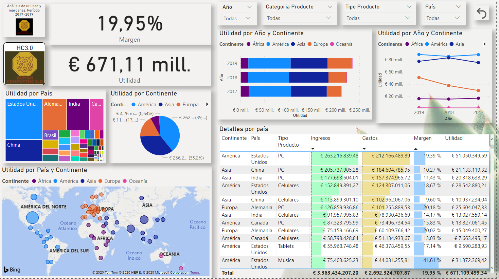
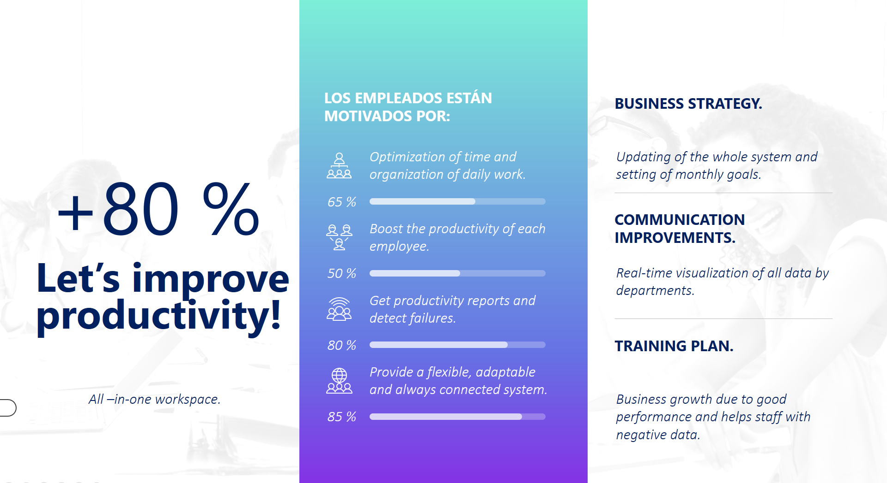
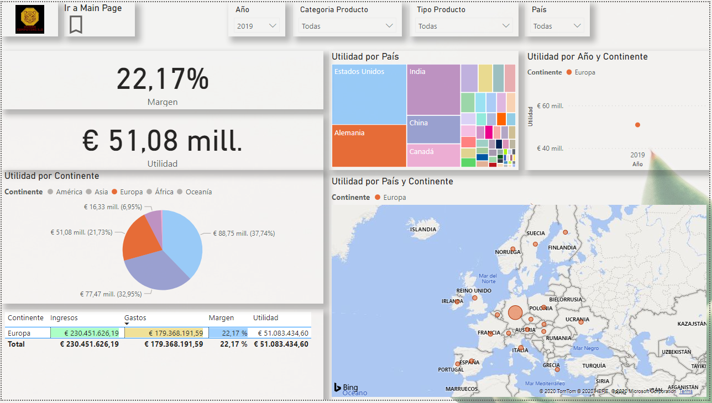
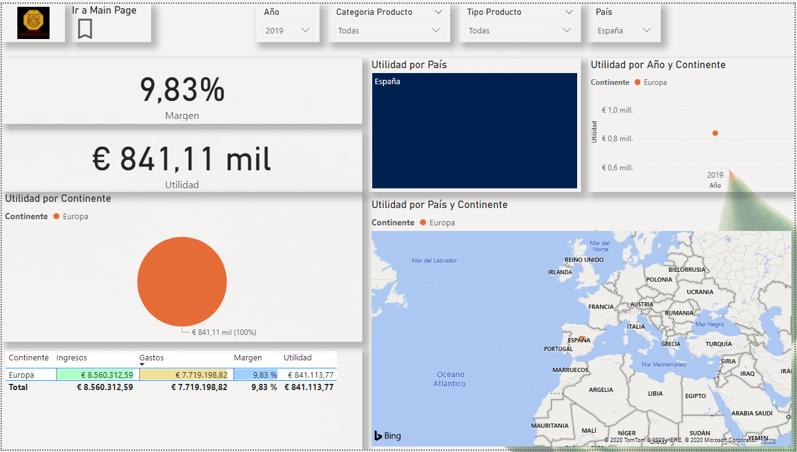

# Proyecto con Microsoft PowerBi - HumanComputing3.0.

<h1><a href="https://powerbi.microsoft.com/" target="<i>blank" rel="noopener noreferrer"># <i>PowerBi<i></a></h1>

    Power BI es un servicio de análisis empresarial de Microsoft, su objetivo es proporcionar visualizaciones interactivas y capacidades de inteligencia empresarial (en inglés: business intelligence o BI) con una interfaz lo suficientemente simple como para que los usuarios finales creen sus propios informes y paneles.  
    Power BI proporciona servicios de BI basados en la nube, conocidos como "Power BI Services", junto con una interfaz basada en escritorio, denominada "PowerBI Desktop". Ofrece capacidades de almacenamiento de datos, incluyendo preparación de datos, descubrimiento de datos y paneles interactivos. En marzo de 2016, Microsoft lanzó un servicio adicional llamado "Power BI Embedded" en su Azure plataforma en la nube. Uno de los principales diferenciadores del producto es la capacidad de cargar visualizaciones personalizadas.

    <h3>Componentes clave</h3>

    
    Los componentes clave del ecosistema de Power BI comprenden:
    <ul>
        <li> Power BI Desktop La aplicación basada en escritorio de Windows para equipos y escritorios, principalmente para diseñar y publicar informes en el servicio. </li>
        <li> Power BI Service El servicio en línea basado en SaaS (software como servicio) (anteriormente conocido como Power BI para Office 365, ahora denominado PowerBI.com o simplemente Power BI).</li>
        <li> Power BI Mobile Apps Las aplicaciones de Power BI Mobile para dispositivos Android y iOS, así como para teléfonos y tabletas Windows. </li>
        <li> Power BI Gateway Puertas de enlace que se usan para sincronizar datos externos dentro y fuera de Power BI. En el modo empresarial, también pueden usar los flujos y  </li>
        <li> PowerApps en Office 365. </li>
        <li> Power BI Embedded La REST API de Power BI se puede usar para crear paneles e informes en las aplicaciones personalizadas que sirven a los usuarios de Power BI, así como a los usuarios que no son de    Power BI.  </li>
        <li> Power BI Report Server Una solución de informes de Power BI local para empresas que no almacenan o no los datos en el servicio Power BI basado en la nube. Power BI Visuals Marketplace  </li>
        <li> Power BI Visuals Marketplace Un mercado de objetos visuales personalizados y objetos visuales con tecnología R. </li>
    </ul>

<h1>¿Qué es Power Bi Desktop?:</h1>

    Power BI Desktop es una aplicación de escritorio gratuita que funciona con el servicio de Power BI. Se puede instalar directamente en sus equipos y nos ayuda a explorar los datos, de una manera más profunda y avanzada. Entre sus funcionalidades, está el modelado de estos datos en informes muy visuales y altamente interactivos. 
    Su perfecta integración nos da la posibilidad de guardar sus trabajos en archivos dentro del propio Power BI, y la de compartirlos con otros usuarios. 
    Power BI Desktop, es una aplicación de escritorio gratuita que se puede instalar directamente en un equipo. Lo único que necesitamos es un explorador web y una dirección de correo electrónico del trabajo.

<h1>Creación del proyecto de BI para APPOL & HC3.0 </h1>

    En este proyecto realizamos la creación de reportes &amp; fundamentos de Business Intelligence con Power BI - ETL en Power Query, Fórmulas DAX, Análisis de datos con Dash Boards.
    <blockquote>
        
    </blockquote>
    El proyecto consiste en la creación de un Dash Board con la base de datos proporcionada, con la función de hacer más visual los datos que se tienen, en este caso, se tratan de utilidad, márgenes y estudio de los agentes de las empresas APPOL & HC·3.0.
    <blockquote>
        
    </blockquote>
    Transformando y extrayendo los datos más valisoso o <i>insights</i>.  
    El esquema realizado para esta tarea fue el siguiente:
    <blockquote>
        
    </blockquote>
   El <i>objetivo principal</i> mejorar nuestros cuadros de mando, con el análisis de los datos, viendo la evolución y los resultados de productividad desde una única plataforma.  
   <i>Objetivo secundario</i> impulsar el negocio.  
   <blockquote>
        
    </blockquote>

<h1>Descripción de las tareas del proyecto.</h1>

    En esta ocasión tenemos a las empresas Appol, HC3 y Tractchun, compañías de la industria manufacturera, que cuentan con la unión de agentes, encargados en Tecnologías de ls Información (TI) quienes dan soporte a Tickets/partes de incidencias para todo lo referente a sus tecnologías de SE (Sistemas, Hardware, Software, etc).  
    El gerente del equipo requiere monitorizar y revisar áreas de mejora de sus servicios, para lo cual ha extraído una parte del sistema de BDs de Tickets que tienen, además, pide realizar un análisis profundo en base a la clasificación de sus empleados.  
    El resultado final, será un informe en tiempo real para gerencia y otros para la plantilla.
    <cite>
        Vista para reportes de gerencia.
        <blockquote>
             Gerencia.
        </blockquote>
        Vista para reportes de plantilla en Europa.
        <blockquote>
             Europa.
        </blockquote>
        Vista para reportes de plantilla en España.
        <blockquote>
             España.
        </blockquote>
    </cite>

<h2>Aplicando los cambios de estilos para el modelo de gerencia. - Claro/Oscuro</h2>

    <blockquote>
         España.
    </blockquote>
    <blockquote>
         España.
    </blockquote>

